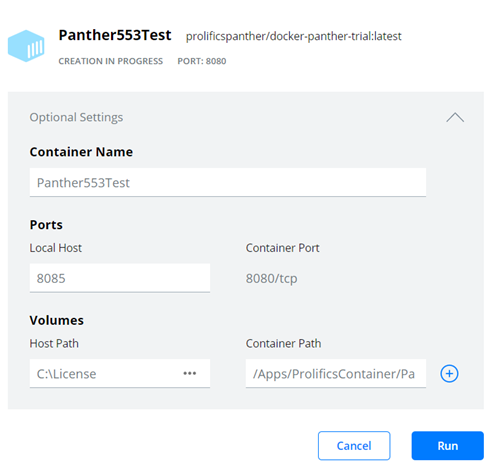
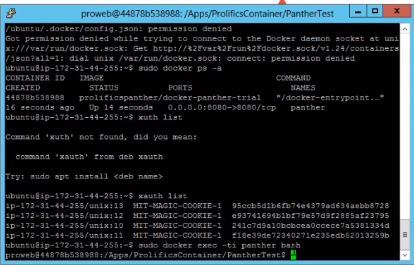

# docker-panther-trial
This Docker file contains a limited version of the Panther Editor , Panther Runtime and Panther Web software . The essential files required to execute the Panther Editor as well as deploy your Panther Screens to the web are included in this image. It can  be directly pulled from [Docker Hub](https://hub.docker.com/repository/docker/prolificspanther/docker-panther-trial).

### Usage
* Panther Web 5.53
* Base OS: Ubuntu 20.04

# Prerequisites: (Required)
  * Install Docker Engine from  https://docs.docker.com/get-docker/ 
  
  Included in  our container
  * Panther 5.53
  * OpenJDK 8
  * Linux Server(Ubuntu 20.04)
  * Tomcat.zip 
  * docker-entrypoint.sh (keeps Catalina and Panther Application running)
  
 # Prerequisites: (Optional)
   Enable port 8080 from your host machine to access the Panther Web application from other clients.
    
 # Download the Panther Docker image:
    
   docker push prolificspanther/docker-panther-trial
  
 # Contents of the container:
 * OpenJDK 8
 * Ubuntu 20.04
 * Panther Web 5.53.07 
 * Tomcat (Configured)
 * Panther Servlet
 * PantherDemo.ini file for Panther Web (Configured)
 
 # How to use docker-panther-trial

Before you create a Panther Container, you must have a valid Panther license on the host machine. Just contact support@prolifics.com for a temporary license. Your Docker Container must be able to access that license file. Instructions provided below

### Panther on Docker Desktop for Windows

**Prerequisites:** Install Docker Desktop with WSL(Installed with Docker Desktop) on Windows 10. Please follow the link to setup [Docker Desktop](https://docs.docker.com/desktop/windows/install/)

Step-1: Open a Command Prompt or a Windows PowerShell to pull the Panther image. Use the  command:
 `docker pull prolificspanther/docker-panther-trial`

Step-2: Open your Docker Desktop application and select "Images" on the left panel. You will see the 'prolificspanther/docker-panther-trial .

Step-3: To create and run a Panther container, choose the image and click the "Run" button. A configuration dialogue box will open.

Step-4: Enter the proper values in fields.

Host Path: Path of license folder on host  machine
Container Path:Must be set to  /Apps/ProlificsContainer/prlstdwb553.07/licenses

Step-5: Click  on Run button and your Panther Container will create and start. It will appear in the Container section.

Step-7: Select the running container and select the icon "OPEN IN BROWSER". Your Windows brower will open and TomCat Apaches' Dashboard will appear. Append "/PantherDemo/PantherDemo/login" in the URL and you will see Panther Web 'serving' up a sample Panther login screen.

Step-8: To execute the Panther Editor, select the running container and  then choose the select "CLI" icon. Run the command "prodev". 

### Panther Character Mode
 
**Prerequisites:** Docker engine installed on your Linux server
 
Step-1: `docker pull prolificspanther/docker-panther-trial` to pull the Panther image.

Step-2: `docker run --name=panther -v <path of license folder on host  machine>:/Apps/ProlificsContainer/prlstdwb553.07/licenses -p8080:8080 -d prolificspanther/docker-panther-trial` . The run command  will create a Panther container.

Step-3: `docker exec -ti panther bash`

Step-4: `Open the Panther Editor using the command > prodev`

Step-5: `To Run a sample Panther client application use command > prorun mgmt (screen name) `           

### Panther Motif

**Prerequisites:** Docker engine installed on your Linux server.To run Panther in Motif,  install (https://x.cygwin.com/) and start the X Server on your Windows machine. If using, please enable SSH>X11(Enable X11 forwarding and enter host machine IP:0.0). 

Step-1: `docker pull prolificspanther/docker-panther-trial` to pull the Panther image. 
 
Step-2: `docker run --name=panther553 -ti --net=host -e DISPLAY -v /tmp/.X11-unix -v <path of license folder on host  machine>://Apps/ProlificsContainer/prlstdwb553.07/licenses -d prolificspanther/docker-panther-trial` .The run command  will create a container named 'panther553' .

Step-3: Next  enter the command to run a graphical application on Linux (Panther Web application in  your browser) 
        `xauth list`  
        It will display a  MIT-MAGIC-COOKIE list as shown in the example below. Just copy any line  and run it .  
        Example:`ip-your ip/unix:10  MIT-MAGIC-COOKIE-1  83cce042f30c980a97e6799713e9e3f2`
        

Step-4: `docker exec -ti panther553 bash`  to run a new command  in a running command.  Notice  the prompt has changed to name of your container.

Step-5: Enter the  command
        `xauth add <paste MIT- MAGIC-COOKIE  used previously>`   We can verify that it was added using the `xauth list` command. 
        
Step-6: Open the Panther Editor in Motif with the command
        `prodev_motif` 

Step 7: To run a sample Panther client application in Motif use command  
        `prorun_motif mgmt (screen name)`    

# To access the image from OpenShift

Step-1: Create a Project

Step-2: Click on Deploy an image

Step-3: Enter image name "prolificspanther/docker-panther-trial", specify the name of component.

Step-4: Click "Create".

Step-5: In Pods section, select your Pod it will open a new Pod window.

Step-6: Enter into the Pod by click on its name and switch to "Terminal" tab.

Step-7: Run the command( to test prodev): > "prodev"

Step-8: Run the command (to test sample Panther client app):>prorun mgmt (Name of Panther screen).    

## License

If you have trouble  with the Panther license file, set the license file  in the environment using  the command `export LM_LICENSE_FILE=/Apps/ProlificsContainer/prlstdwb553.07/licenses/license.dat`
NOTE: Do not alter the location of the license file. Once prodev opens you may open the login screen located in screens.lib

For Panther Cloud License, contact support@prolifics.com

[View](https://github.com/ProlificsPanther/DockerPanther/blob/master/SoftwareLicenseAgreement.pdf) license information for the software contained in this image.

As with all Docker images, these likely also contain other software which may be under other licenses (such as Bash, etc from the base distribution, along with any direct or indirect dependencies of the primary software being contained).

As for any pre-built image usage, it is the image user's responsibility to ensure that any use of this image complies with any relevant licenses for all software contained within.

## Issues
If you face any issues with this image, report them [here](https://github.com/ProlificsPanther/Docker-Panther/issues)

## Contribution
You are invited to contribute new features, fixes, or updates, large or small; we are always thrilled to receive pull requests, and do our best to process them as fast as we can.

Before you begin to code, we recommend discussing your plans through a [GitHub issue](https://github.com/ProlificsPanther/Docker-Panther/issues), especially for more ambitious contributions. This gives other contributors a chance to point you in the right direction, give you feedback on your design, and help you find out if someone else is working on the same thing.

Read our Documentation [here](https://docs.prolifics.com)
