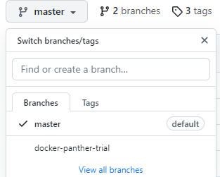
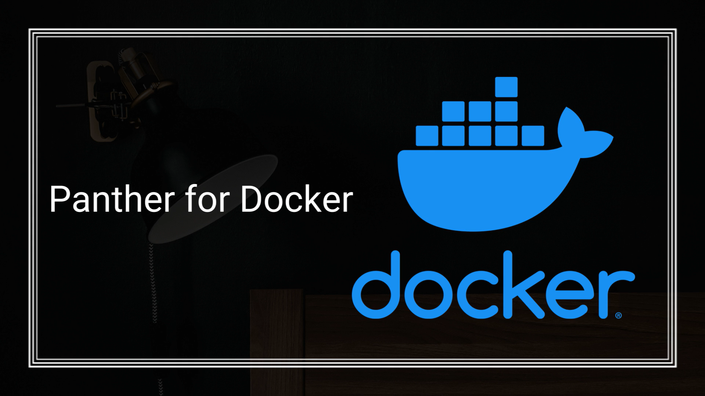

# What is Panther?
Panther is a RAD platform that enables the development of mobile, web and desktop applications.
For more information on Panther components, please visit https://www.prolifics.com/jampanther-tools

# What is Docker?
Docker is a tool designed to make it easier to create, deploy, and run applications by using containers. Containers allow a developer to package up an application with all of the parts it needs, such as libraries and other dependencies, and deploy it as one package.

# What this repository contains
This repository contains two branches ; PantherClient, PantherWeb based on docker Panther images. PantherClient consist of sample dockerfile to dockerize panther client application and  PantherWeb consists of sample dockerfile to dockerize panther client as well as web application. 

# Panther with Docker
Conteinerize Panther client as well as web application that makes easy to develop and deploy. It will also helpful to make it available globally on Docker Hub(hub.docker.com). Our Sample Docker Panther images for Panther Client and Panther Web are avialble on Docker hub. Just run a Docker pull.

# Prerequisites: (Required)
  * Install Docker Engine from  https://docs.docker.com/get-docker/ 
  
  Provided in Container
  * Panther 5.5*
  * JDK : https://www.oracle.com/technetwork/java/javase/downloads/java-archive-javase8-2177648.html
  * Linux Server(Red Hat)
  * Tomcat.zip(included)
  * TestMigration.zip(included)
  * lynx.rpm (character mode browser, suited for Linux systems)
  * docker-entrypoint.sh ( keeps catalina and Panther App running)
  
 # Prerequisites: (Optional)
   Enable port 8080 from your host machine so that you can check your URL outside the host machine also.
    
 # Downloading the Panther Docker image::
   Use the command  below
   docker pull prolificspanther/pantherweb  
   
 # Contents of the container:
 * JDK 1.8
 * Red Hat
 * Panther Web 553.07 (License Inclusive)
 * Tomcat (Configured)
 * Panther Servlet
 * PantherDemo.ini file for Panther Web (Configured)
 
 # How to use this Image
   This image is designed to be used in your Panther Web Enviroment in your Red Hat server. Installing a Panther Web Docker image should take less than 10 minutes to setup. Once    complete you will be able run our sample testcases.
 
* Creating the container:
  docker run --name=pantherweb -p8080:8080 -d prolificspanther/pantherweb

* Enter the container(To be used in non-UI base OS & for migrating the screens):
  docker exec -ti pantherweb bash

* Test our Samples(already packed in image):
  
  ### For Non-UI base:
    * Run prodev: "prodev" (Without Quotes)
  * Run proweb:
    lynx localhost:8080/PantherDemo/login
  OR
  lynx localhost:8080/PantherDemo/orders
  OR
  lynx localhost:8080/PantherDemo/customer
  
 * Run the migration utility(Do this from a separate maximized Terminal) : java -jar migration.jar

 * Please access the following URL from an OS with UI enabled:

(IP):8080/PantherDemo/PantherDemo/(screen_name_you_ran_the_migration_utility_on)

Note: This will only work if you've enabled port 8080 on your host system to communicate externally.

### For base OS with UI:
* For prodev: Just run "prodev" (without double quotes)
* For accessing the Panther screens using proweb:

  Call the URL from the browser:
  localhost:8080/PantherDemo/PantherDemo/login
  OR
  localhost:8080/PantherDemo/PantherDemo/orders
  OR
  localhost:8080/PantherDemo/PantherDemo/customer

 * Run the migration utility(Do this from a Terminal):
   java -jar migration.jar

 Recall the URL with the screen name that you ran the migration utility on the browser to see the changes

# To access the image from Openshift:
1) Create a Project
2) Click on Deploy an image
3) Search for "prolificspanther/pantherweb", specify the name.
4) Click "Deploy".
5) Go to the Pods section, as soon as it changes from "Creating container" to "Running", enter into the Pod and switch to "Terminal" tab.
6) Run the command( to test prodev):
Run the command "prodev"
 
7) Run the command( to test proweb):
lynx localhost:8080/PantherDemo/PantherDemo/login
OR
lynx localhost:8080/PantherDemo/PantherDemo/orders
OR
lynx localhost:8080/PantherDemo/PantherDemo/customer

## Issues
If you face any kind of issues with this image, report them [here](https://github.com/ProlificsPanther/Docker-Panther/issues)

## Contribution
You are invited to contribute new features, fixes, or updates, large or small; we are always thrilled to receive pull requests, and do our best to process them as fast as we can.

Before you begin to code, we recommend discussing your plans through a [GitHub issue](https://github.com/ProlificsPanther/Docker-Panther/issues), especially for more ambitious contributions. This gives other contributors a chance to point you in the right direction, give you feedback on your design, and help you find out if someone else is working on the same thing.

How to set up a Panther Servlet Web Application? [Click Here](https://github.com/ProlificsPanther/PantherWeb/releases "Named link title")

Read our Documentation [here](https://docs.prolifics.com)
